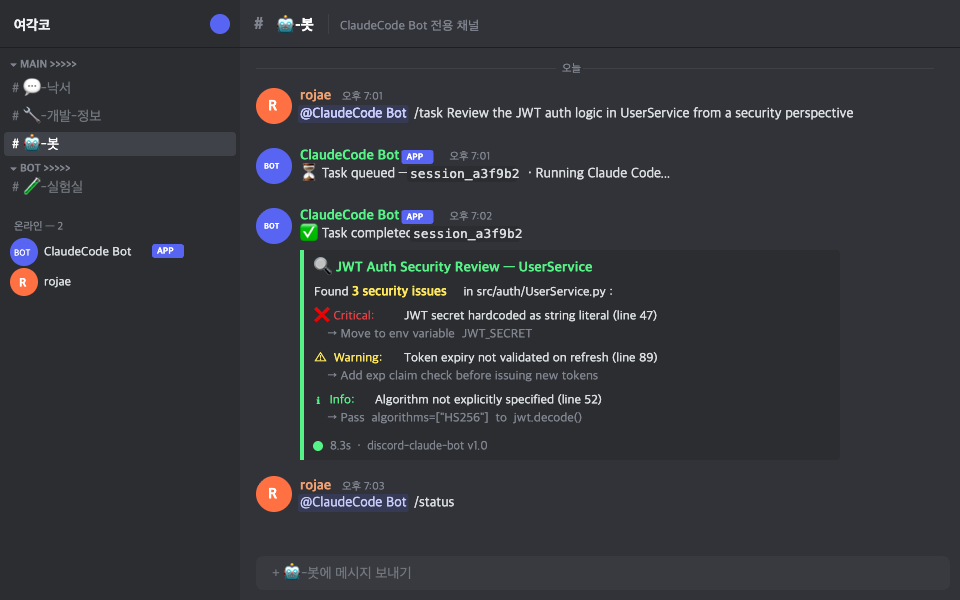
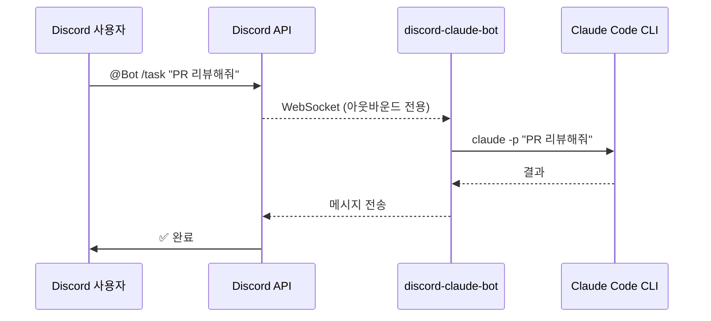
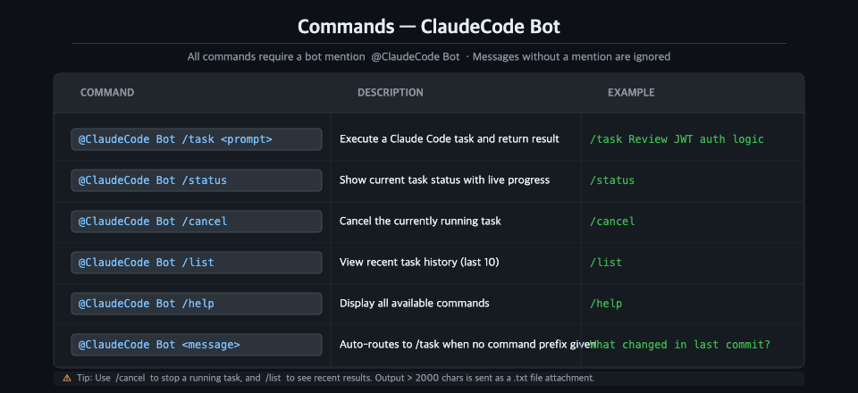
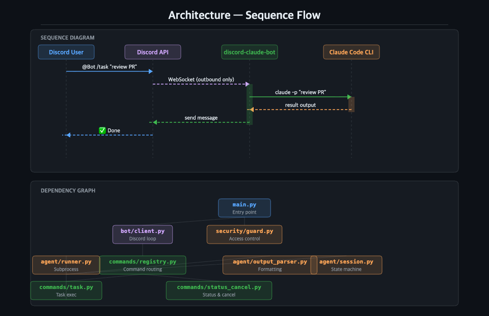
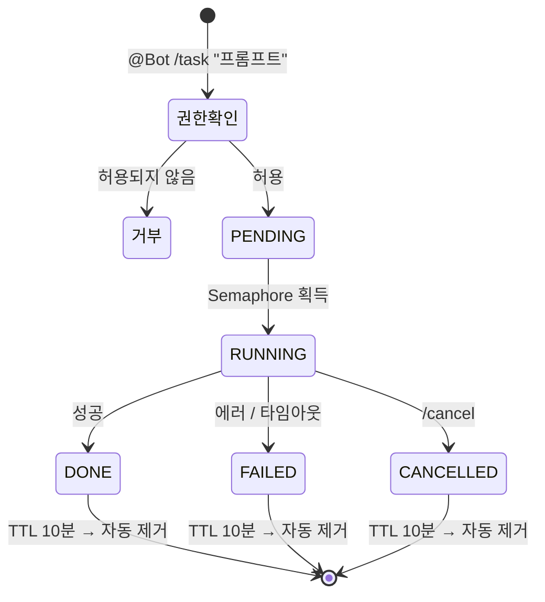
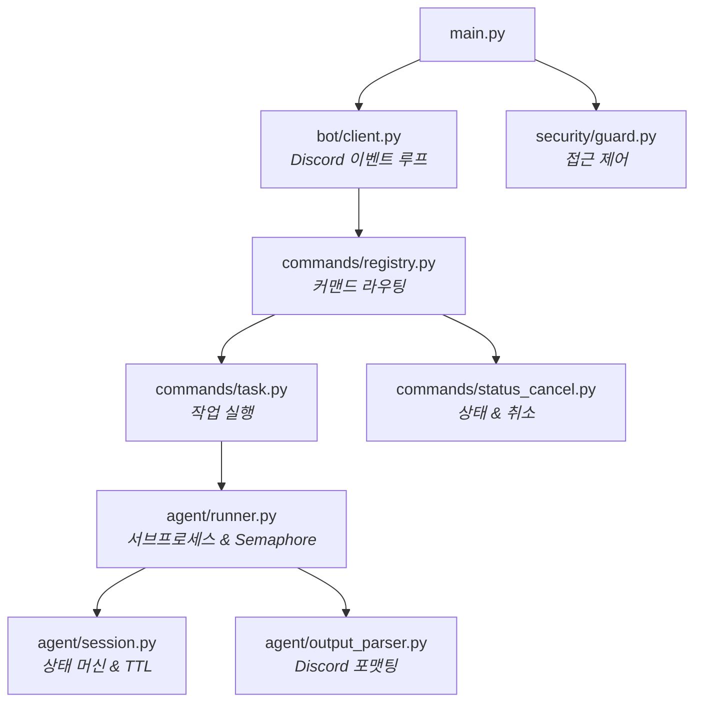

<div align="center">

<br>


# discord-claude-bot

**Discord에서 Claude Code를 원격 제어 — 포트 오픈 불필요**

<br>

[](https://python.org)
[](https://discordpy.readthedocs.io)
[](https://docs.anthropic.com/claude-code)
[](LICENSE)
[](http://makeapullrequest.com)

[**시작하기**](#-시작하기) &#8226; [**명령어**](#-명령어) &#8226; [**설정**](#%EF%B8%8F-설정) &#8226; [**아키텍처**](#-아키텍처) &#8226; [**보안**](#-보안)

<br>

</div>

## 왜 필요한가?



강력한 로컬 머신에서 Claude Code를 실행하고 있습니다. 핸드폰, 태블릿, 다른 PC 어디서든 트리거하고 싶지만 포트를 열거나 터널을 설정하고 싶지는 않습니다.

**discord-claude-bot**은 **아웃바운드 WebSocket 연결만** 사용하여 Discord와 로컬 Claude Code CLI를 연결합니다. 방화벽 변경 불필요. ngrok 불필요. 공인 IP 불필요.



---

## 주요 특징

<table>
<tr>
<td width="50%">

**멘션 기반 제어**
<br><sub>모든 명령어는 <code>@Bot</code> 멘션 필수 — 일반 슬래시 명령과 충돌 없음</sub>

**동시성 제어 & 큐잉**
<br><sub>Semaphore 기반 전역 제한 + 유저당 중복 실행 방어. 슬롯 부족 시 자동 대기.</sub>

**자동 파일 전환**
<br><sub>Discord 2000자 제한 초과 시 자동으로 <code>.txt</code> 파일로 첨부 전송</sub>

</td>
<td width="50%">

**방화벽 친화적**
<br><sub>아웃바운드 전용 WebSocket. 인바운드 포트 제로. 사내 방화벽 뒤에서도 동작.</sub>

**좀비 프로세스 방지**
<br><sub>설정 가능한 타임아웃으로 멈춘 프로세스 자동 종료. 고아 세션 없음.</sub>

**오프라인 복원력**
<br><sub>오프라인 중 쌓인 메시지를 재시작 시 선택적으로 무시 — 밀린 명령 폭주 방지.</sub>

</td>
</tr>
</table>

---

## 명령어



| 커맨드 | 설명 |
|:-------|:-----|
| `@Bot /task <프롬프트>` | Claude Code 작업 실행 후 결과 전송 |
| `@Bot /status` | 현재 작업 상태 + 실시간 진행 상황 조회 |
| `@Bot /cancel` | 진행 중인 작업 취소 |
| `@Bot /list` | 최근 작업 이력 조회 (최대 10개) |
| `@Bot /help` | 사용 가능한 명령어 표시 |
| `@Bot <메시지>` | 커맨드 없이 멘션 시 `/task`로 자동 라우팅 |

> 모든 명령어는 봇 멘션(`@Bot`)이 필요합니다. 멘션 없는 메시지는 무시됩니다.

---

## 시작하기

### 사전 요구사항

| 요구사항 | 버전 | 비고 |
|:---------|:-----|:-----|
| Python | 3.11+ | 가상환경 권장 |
| Claude Code CLI | 최신 | [설치 및 인증 완료](https://docs.anthropic.com/claude-code) 필요 |
| Discord Bot Token | — | [아래 가이드](#1-discord-bot-생성) 참고 |

### 1. Discord Bot 생성

1. [Discord Developer Portal](https://discord.com/developers/applications)에서 **New Application** 클릭
2. **Bot** 탭 → **Reset Token** → 토큰 복사
3. **Privileged Gateway Intents** → **Message Content Intent** 활성화
4. **OAuth2 → URL Generator** → `bot` 스코프 + 권한 선택:
   - `Send Messages`
   - `Read Message History`
   - `Attach Files`
5. 생성된 URL로 서버에 봇 초대

### 2. 설치

```bash
git clone https://github.com/your-id/discord-claude-bot.git
cd discord-claude-bot

python -m venv .venv
source .venv/bin/activate   # Windows: .venv\Scripts\activate
pip install discord.py pydantic pydantic-settings python-dotenv
```

### 3. 환경 설정

```bash
cp .env.example .env
```

`.env` 파일 편집:

```env
DISCORD_TOKEN=your_bot_token_here
ALLOWED_USER_IDS=[123456789012345678]     # 본인 Discord 유저 ID (JSON 배열)
CLAUDE_WORKING_DIR=/path/to/your/project  # Claude Code 작업 디렉토리
```

### 4. 실행

```bash
# 포그라운드 (개발용)
python main.py

# 백그라운드 (프로덕션)
./run.sh        # 데몬으로 시작
./status.sh     # 실행 상태 확인
./stop.sh       # 정상 종료 (SIGTERM)
./kill.sh       # 강제 종료 (SIGKILL)
```

---

## 설정

모든 설정은 환경변수(`.env` 파일)로 관리합니다.

### 필수

| 변수 | 설명 |
|:-----|:-----|
| `DISCORD_TOKEN` | Discord Bot Token |

### Discord

| 변수 | 기본값 | 설명 |
|:-----|:-------|:-----|
| `COMMAND_PREFIX` | `/` | 명령어 접두사 |
| `ALLOWED_CHANNEL_IDS` | `[]` (전체) | 허용 채널 ID 제한 (JSON 배열) |
| `ALLOWED_USER_IDS` | `[]` (전체) | 허용 유저 ID 제한 (JSON 배열) |
| `DISCORD_MESSAGE_LIMIT` | `2000` | 파일 전환 전 최대 메시지 길이 |

### Claude Code

| 변수 | 기본값 | 설명 |
|:-----|:-------|:-----|
| `CLAUDE_BINARY` | `claude` | Claude Code CLI 실행 경로 |
| `CLAUDE_WORKING_DIR` | `.` | Claude Code 작업 디렉토리 |
| `CLAUDE_TIMEOUT` | `300` | 작업 타임아웃 (초) |
| `CLAUDE_MAX_OUTPUT` | `3000` | 최대 출력 글자수 |
| `CLAUDE_MAX_CONCURRENT` | `3` | 최대 동시 실행 세션 수 |

### 동작

| 변수 | 기본값 | 설명 |
|:-----|:-------|:-----|
| `POLL_INTERVAL_SECONDS` | `1.0` | 작업 완료 확인 주기 (초) |
| `NOTIFY_ON_COMPLETE` | `true` | 작업 완료 시 알림 전송 |
| `NOTIFY_ON_ERROR` | `true` | 작업 실패 시 알림 전송 |
| `SKIP_MISSED_MESSAGES` | `true` | 오프라인 중 쌓인 메시지 무시 |
| `LOG_LEVEL` | `INFO` | 로그 레벨 (`DEBUG` / `INFO` / `WARNING` / `ERROR`) |

---

## 아키텍처



### 세션 생애주기

모든 작업은 결정적(deterministic) 상태 머신을 따릅니다:



### 의존성 그래프



### 설계 원칙

| 원칙 | 구현 |
|:-----|:-----|
| **의존성 주입** | `main.py`가 모든 것을 조립 — 모듈은 구체 타입이 아닌 인터페이스에 의존 |
| **단방향 흐름** | `bot → commands → agent` — 역방향 참조 없음 |
| **단일 진실 공급원** | `Session` 객체가 모든 작업 상태를 소유 |
| **동시성 안전** | `asyncio.Semaphore`로 실행 제한, `asyncio.Lock`으로 세션 저장소 보호 |
| **GC 보호** | `create_task()` 반환값을 `set`에 보관하여 가비지 컬렉션 방지 |

### 프로젝트 구조

```
discord-claude-bot/
├── main.py                  # 진입점 — DI 조립 & 정리 루프
├── run.sh                   # 백그라운드 시작 (nohup)
├── stop.sh                  # 정상 종료 (SIGTERM)
├── kill.sh                  # 강제 종료 (SIGKILL)
├── status.sh                # 봇 프로세스 상태 확인
├── .env.example             # 환경변수 템플릿
├── pyproject.toml           # 프로젝트 메타데이터
├── README.md                # 영문 문서
├── README.ko.md             # 본 파일
└── src/
    ├── config.py            # 환경변수 설정 (pydantic-settings)
    ├── bot/
    │   └── client.py        # Discord 클라이언트, 이벤트 핸들러
    ├── commands/
    │   ├── registry.py      # 커맨드 파싱 & 라우팅
    │   ├── task.py           # /task 커맨드 핸들러
    │   └── status_cancel.py # /status, /cancel, /list 핸들러
    ├── agent/
    │   ├── runner.py         # Claude CLI 프로세스 관리
    │   ├── session.py        # 세션 상태 머신 & 정리
    │   └── output_parser.py  # Discord용 출력 포맷팅
    └── security/
        └── guard.py          # 접근 제어 (유저/채널/DM)
```

---

## 사용 예시

```bash
# 코드 리뷰
@Bot /task UserService의 JWT 인증 로직 보안 관점에서 리뷰해줘

# 성능 분석
@Bot /task MSSQL 프로시저 성능 병목 분석해줘

# Git 워크플로우
@Bot /task 현재 브랜치 변경사항 기반으로 PR 설명 작성해줘

# 간단한 질문 (/task로 자동 라우팅)
@Bot 마지막 커밋에서 변경된 파일이 뭐야?

# 작업 관리
@Bot /status       # 진행 상황 확인
@Bot /cancel       # 작업 취소
@Bot /list         # 이력 조회
```

> 출력이 Discord 메시지 한도를 초과하면 `result_<session_id>.txt` 파일로 자동 첨부됩니다.

---

## 보안

> **중요:** 프로덕션 환경에서는 반드시 `ALLOWED_USER_IDS`와 `ALLOWED_CHANNEL_IDS`를 설정하세요.
> 설정하지 않으면 **서버의 모든 멤버**가 로컬 머신에서 명령을 실행할 수 있습니다.

| 계층 | 보호 |
|:-----|:-----|
| **인증** | 허용 목록 기반 유저 ID / 채널 ID 필터링 |
| **DM 차단** | DM을 통한 명령은 구조적으로 거부 (길드 컨텍스트 필수) |
| **토큰 관리** | Bot 토큰은 `.env`에서만 관리 — 소스 코드에 절대 포함하지 않음 |
| **디렉토리 격리** | `CLAUDE_WORKING_DIR`로 Claude Code를 특정 프로젝트 루트로 제한 |
| **프로세스 격리** | 각 작업은 타임아웃이 적용된 자식 프로세스로 실행 |
| **동시성 제한** | Semaphore 기반 세션 상한으로 리소스 고갈 방지 |

---

## 문제 해결

<details>
<summary><b>봇이 온라인이지만 명령에 반응하지 않음</b></summary>

- Discord Developer Portal에서 **Message Content Intent**가 활성화되어 있는지 확인
- 봇을 멘션하고 있는지 확인 (`@BotName`) — 단순 `/명령어`는 무시됨
- `ALLOWED_USER_IDS`에 본인의 Discord 유저 ID가 포함되어 있는지 확인
- `ALLOWED_CHANNEL_IDS`에 사용 중인 채널이 포함되어 있는지 확인 (빈 배열이면 전체 허용)
</details>

<details>
<summary><b>Claude CLI를 찾을 수 없음</b></summary>

- `CLAUDE_BINARY`를 절대 경로로 설정: `CLAUDE_BINARY=/opt/homebrew/bin/claude`
- Claude Code 설치 확인: `which claude` 또는 `claude --version`
</details>

<details>
<summary><b>작업 타임아웃 발생</b></summary>

- `CLAUDE_TIMEOUT` 값 증가 (기본: 300초)
- 대규모 코드베이스의 경우 `CLAUDE_TIMEOUT=7200` (2시간) 권장
</details>

<details>
<summary><b>재시작 시 밀린 메시지를 처리함</b></summary>

- `SKIP_MISSED_MESSAGES=true` (기본값)로 설정하여 오프라인 중 쌓인 메시지 무시
</details>

---

## 기여하기

기여를 환영합니다! Pull Request를 자유롭게 제출해주세요.

1. 저장소를 Fork 합니다
2. 기능 브랜치를 생성합니다 (`git checkout -b feat/amazing-feature`)
3. 변경사항을 커밋합니다 (`git commit -m 'feat: add amazing feature'`)
4. 브랜치에 Push 합니다 (`git push origin feat/amazing-feature`)
5. Pull Request를 생성합니다

---

## 라이선스

이 프로젝트는 **MIT 라이선스** 하에 배포됩니다 — 자세한 내용은 [LICENSE](LICENSE) 파일을 참고하세요.

---

<div align="center">

<sub>[discord.py](https://discordpy.readthedocs.io)와 [Claude Code](https://docs.anthropic.com/claude-code)로 제작되었습니다</sub>

</div>
