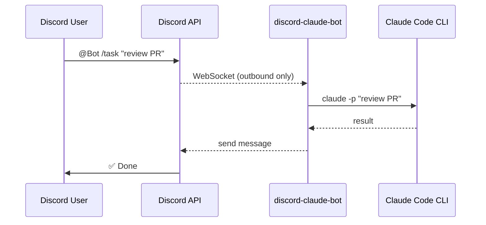
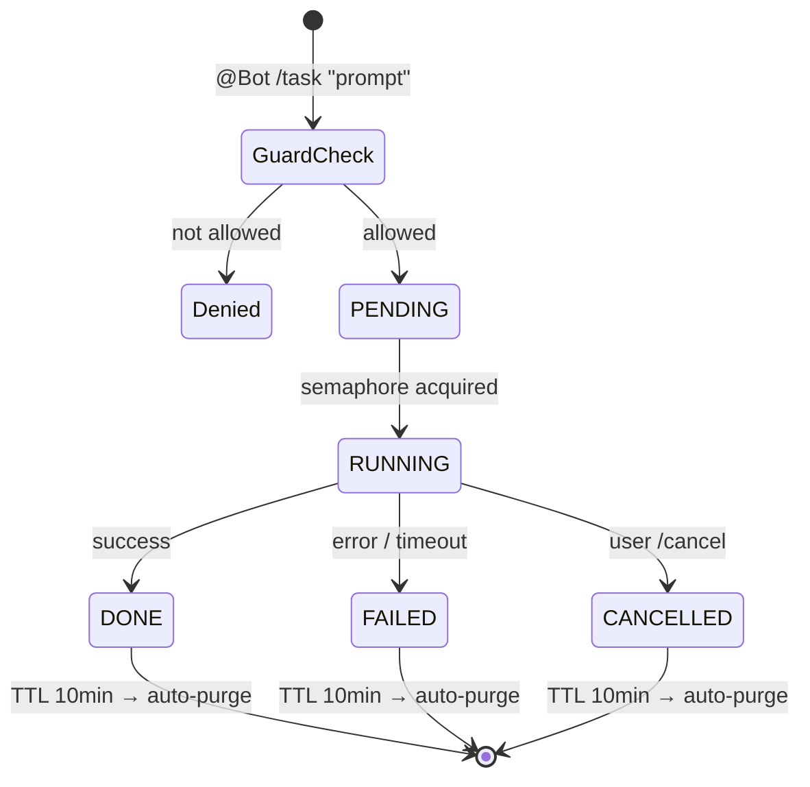
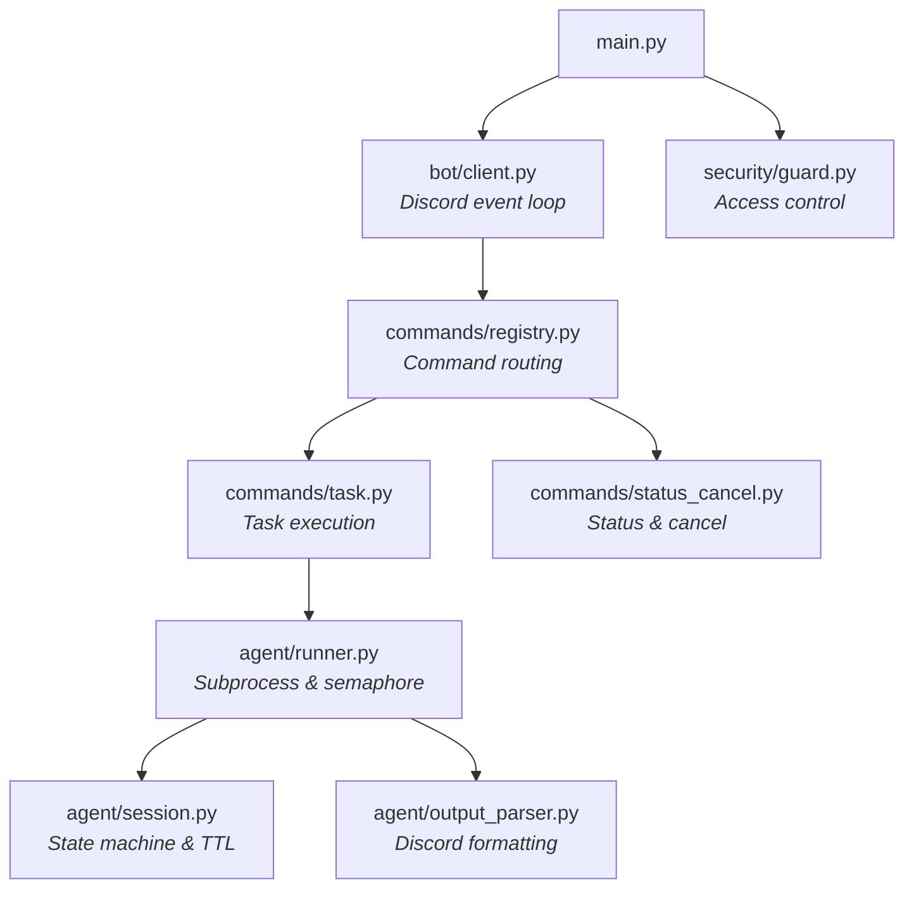

<div align="center">

<br>


# discord-claude-bot

**Remote-control Claude Code from Discord — no open ports required.**

<br>

[](https://python.org)
[](https://discordpy.readthedocs.io)
[](https://docs.anthropic.com/claude-code)
[](LICENSE)
[](http://makeapullrequest.com)

[**Getting Started**](#-getting-started) &#8226; [**Commands**](#-commands) &#8226; [**Configuration**](#%EF%B8%8F-configuration) &#8226; [**Architecture**](#-architecture) &#8226; [**Security**](#-security)

<br>

</div>

## Why?

You have Claude Code running on a powerful local machine. You want to trigger it from anywhere — your phone, a tablet, another PC — without exposing ports or setting up tunnels.

**discord-claude-bot** bridges Discord and your local Claude Code CLI using only **outbound WebSocket connections**. No firewall changes. No ngrok. No public IP.



---

## Highlights

<table>
<tr>
<td width="50%">

**Mention-based Control**
<br><sub>All commands require <code>@Bot</code> mention — no accidental triggers from regular slash commands.</sub>

**Concurrency & Queuing**
<br><sub>Semaphore-based global limit with per-user duplicate guard. Tasks queue when slots are full.</sub>

**Auto File Fallback**
<br><sub>Output exceeding Discord's 2000-char limit is automatically sent as a <code>.txt</code> attachment.</sub>

</td>
<td width="50%">

**Firewall Friendly**
<br><sub>Outbound-only WebSocket. Zero inbound ports. Works behind corporate firewalls.</sub>

**Zombie Prevention**
<br><sub>Configurable timeout auto-kills hanging processes. No orphaned Claude sessions.</sub>

**Offline Resilience**
<br><sub>Messages queued while offline are optionally skipped on restart — no stale command floods.</sub>

</td>
</tr>
</table>

---

## Commands

| Command | Description |
|:--------|:------------|
| `@Bot /task <prompt>` | Execute a Claude Code task and return the result |
| `@Bot /status` | Show current task status with live progress |
| `@Bot /cancel` | Cancel the running task |
| `@Bot /list` | View recent task history (last 10) |
| `@Bot /help` | Display available commands |
| `@Bot <message>` | Auto-routes to `/task` when no command prefix is given |

> All commands require a bot mention (`@Bot`). Messages without a mention are ignored.

---

## Getting Started

### Prerequisites

| Requirement | Version | Notes |
|:------------|:--------|:------|
| Python | 3.11+ | Virtual environment recommended |
| Claude Code CLI | Latest | Must be [installed and authenticated](https://docs.anthropic.com/claude-code) |
| Discord Bot Token | — | [Create one here](#1-create-a-discord-bot) |

### 1. Create a Discord Bot

1. Go to the [Discord Developer Portal](https://discord.com/developers/applications) and click **New Application**
2. Navigate to **Bot** tab → click **Reset Token** → copy the token
3. Enable **Privileged Gateway Intents** → toggle **Message Content Intent**
4. Go to **OAuth2 → URL Generator** → select `bot` scope with permissions:
   - `Send Messages`
   - `Read Message History`
   - `Attach Files`
5. Open the generated URL to invite the bot to your server

### 2. Install

```bash
git clone https://github.com/your-id/discord-claude-bot.git
cd discord-claude-bot

python -m venv .venv
source .venv/bin/activate   # Windows: .venv\Scripts\activate
pip install discord.py pydantic pydantic-settings python-dotenv
```

### 3. Configure

```bash
cp .env.example .env
```

Edit `.env` with your values:

```env
DISCORD_TOKEN=your_bot_token_here
ALLOWED_USER_IDS=[123456789012345678]     # Your Discord user ID (JSON array)
CLAUDE_WORKING_DIR=/path/to/your/project  # Where Claude Code operates
```

### 4. Run

```bash
# Foreground (development)
python main.py

# Background (production)
./run.sh        # Start as daemon
./status.sh     # Check if running
./stop.sh       # Graceful shutdown (SIGTERM)
./kill.sh       # Force kill (SIGKILL)
```

---

## Configuration

All settings are managed via environment variables (`.env` file).

### Required

| Variable | Description |
|:---------|:------------|
| `DISCORD_TOKEN` | Discord Bot Token |

### Discord

| Variable | Default | Description |
|:---------|:--------|:------------|
| `COMMAND_PREFIX` | `/` | Prefix for bot commands |
| `ALLOWED_CHANNEL_IDS` | `[]` (all) | Restrict to specific channel IDs (JSON array) |
| `ALLOWED_USER_IDS` | `[]` (all) | Restrict to specific user IDs (JSON array) |
| `DISCORD_MESSAGE_LIMIT` | `2000` | Max message length before file fallback |

### Claude Code

| Variable | Default | Description |
|:---------|:--------|:------------|
| `CLAUDE_BINARY` | `claude` | Path to Claude Code CLI executable |
| `CLAUDE_WORKING_DIR` | `.` | Working directory for Claude Code |
| `CLAUDE_TIMEOUT` | `300` | Task timeout in seconds |
| `CLAUDE_MAX_OUTPUT` | `3000` | Max characters in output |
| `CLAUDE_MAX_CONCURRENT` | `3` | Max simultaneous sessions |

### Behavior

| Variable | Default | Description |
|:---------|:--------|:------------|
| `POLL_INTERVAL_SECONDS` | `1.0` | How often to check for task completion |
| `NOTIFY_ON_COMPLETE` | `true` | Send message when task finishes |
| `NOTIFY_ON_ERROR` | `true` | Send message on task failure |
| `SKIP_MISSED_MESSAGES` | `true` | Ignore messages queued while bot was offline |
| `LOG_LEVEL` | `INFO` | Logging verbosity (`DEBUG` / `INFO` / `WARNING` / `ERROR`) |

---

## Architecture

### Session Lifecycle

Every task follows a deterministic state machine:



### Dependency Graph



### Design Principles

| Principle | Implementation |
|:----------|:---------------|
| **Dependency Injection** | `main.py` wires everything — modules depend on interfaces, not concrete types |
| **Unidirectional Flow** | `bot → commands → agent` — no reverse references |
| **Single Source of Truth** | `Session` object owns all task state |
| **Concurrency Safety** | `asyncio.Semaphore` for execution limits, `asyncio.Lock` for session store |
| **GC Protection** | `create_task()` refs stored in a `set` to prevent garbage collection |

### Project Structure

```
discord-claude-bot/
├── main.py                  # Entry point — DI assembly & cleanup loop
├── run.sh                   # Start bot in background (nohup)
├── stop.sh                  # Graceful stop (SIGTERM)
├── kill.sh                  # Force stop (SIGKILL)
├── status.sh                # Check bot process status
├── .env.example             # Environment variable template
├── pyproject.toml           # Project metadata
├── README.md                # This file
├── README.ko.md             # Korean documentation
└── src/
    ├── config.py            # Environment config (pydantic-settings)
    ├── bot/
    │   └── client.py        # Discord client, event handlers
    ├── commands/
    │   ├── registry.py      # Command parsing & routing
    │   ├── task.py           # /task command handler
    │   └── status_cancel.py # /status, /cancel, /list handlers
    ├── agent/
    │   ├── runner.py         # Claude CLI process management
    │   ├── session.py        # Session state machine & cleanup
    │   └── output_parser.py  # Output formatting for Discord
    └── security/
        └── guard.py          # Access control (user/channel/DM)
```

---

## Usage Examples

```bash
# Code review
@Bot /task Review the JWT auth logic in UserService from a security perspective

# Performance analysis
@Bot /task Analyze performance bottlenecks in the SQL stored procedure

# Git workflow
@Bot /task Write a PR description based on current branch changes

# Quick questions (auto-routes to /task)
@Bot What files changed in the last commit?

# Task management
@Bot /status       # Check progress
@Bot /cancel       # Stop current task
@Bot /list         # View history
```

> When output exceeds Discord's message limit, it is automatically sent as a `result_<session_id>.txt` file attachment.

---

## Security

> **Important:** Always configure `ALLOWED_USER_IDS` and `ALLOWED_CHANNEL_IDS` in production.
> Without these, **any server member** can execute commands on your local machine.

| Layer | Protection |
|:------|:-----------|
| **Authentication** | Allowlist-based user ID and channel ID filtering |
| **DM Blocking** | Commands via direct message are structurally rejected (requires guild context) |
| **Token Management** | Bot token lives exclusively in `.env` — never committed to source control |
| **Directory Isolation** | `CLAUDE_WORKING_DIR` scopes Claude Code to a specific project root |
| **Process Isolation** | Each task runs as a child process with timeout enforcement |
| **Concurrency Limits** | Prevents resource exhaustion via semaphore-based session caps |

---

## Troubleshooting

<details>
<summary><b>Bot is online but not responding to commands</b></summary>

- Verify **Message Content Intent** is enabled in the Discord Developer Portal
- Ensure you're mentioning the bot (`@BotName`) — bare `/commands` are ignored
- Check `ALLOWED_USER_IDS` includes your Discord user ID
- Check `ALLOWED_CHANNEL_IDS` includes the channel you're using (or leave empty for all channels)
</details>

<details>
<summary><b>Claude CLI not found</b></summary>

- Set `CLAUDE_BINARY` to the absolute path: `CLAUDE_BINARY=/opt/homebrew/bin/claude`
- Verify Claude Code is installed: `which claude` or `claude --version`
</details>

<details>
<summary><b>Tasks timing out</b></summary>

- Increase `CLAUDE_TIMEOUT` (default: 300 seconds)
- For large codebases, consider `CLAUDE_TIMEOUT=7200` (2 hours)
</details>

<details>
<summary><b>Bot processes stale messages on restart</b></summary>

- Set `SKIP_MISSED_MESSAGES=true` (default) to ignore messages queued while offline
</details>

---

## Contributing

Contributions are welcome! Please feel free to submit a Pull Request.

1. Fork the repository
2. Create your feature branch (`git checkout -b feat/amazing-feature`)
3. Commit your changes (`git commit -m 'feat: add amazing feature'`)
4. Push to the branch (`git push origin feat/amazing-feature`)
5. Open a Pull Request

---

## License

This project is licensed under the **MIT License** — see the [LICENSE](LICENSE) file for details.

---

<div align="center">

<sub>Built with [discord.py](https://discordpy.readthedocs.io) and [Claude Code](https://docs.anthropic.com/claude-code)</sub>

</div>
